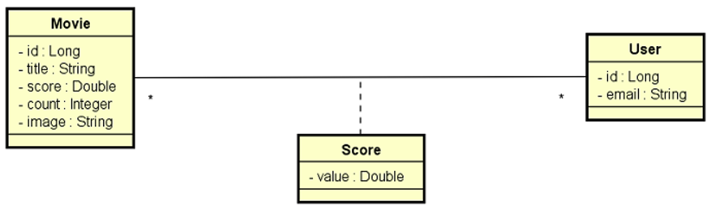

# Desafio DSMovie RestAssured
Você deve implementar todos os testes de API conforme solicitado (assista o vídeo explicativo)

## Sobre o projeto DSMovie:
Este é um projeto de filmes e avaliações de filmes. A visualização dos dados dos filmes é pública (não necessita login), porém as alterações de filmes (inserir, atualizar, deletar) são permitidas apenas para usuários ADMIN. As avaliações de filmes podem ser registradas por qualquer usuário logado CLIENT ou ADMIN. A entidade Score armazena uma nota de 0 a 5 (score) que cada usuário deu a cada filme. Sempre que um usuário registra uma nota, o sistema calcula a média das notas de todos usuários, e armazena essa nota média (score) na entidade Movie, juntamente com a contagem de votos (count).  Veja vídeo explicativo.

## Abaixo estão os testes de API que você deverá implementar utilizando o RestAssured. O mínimo para aprovação no desafio são 8 dos 10 testes.

### MovieContollerRA:
 [x] findAllShouldReturnOkWhenMovieNoArgumentsGiven
 [x] findAllShouldReturnPagedMoviesWhenMovieTitleParamIsNotEmpty
 [x] findByIdShouldReturnMovieWhenIdExists
 [x] findByIdShouldReturnNotFoundWhenIdDoesNotExist
 [x] insertShouldReturnUnprocessableEntityWhenAdminLoggedAndBlankTitle
 [x] insertShouldReturnForbiddenWhenClientLogged
 [x] insertShouldReturnUnauthorizedWhenInvalidToken

### ScoreContollerRA:
 [x] saveScoreShouldReturnNotFoundWhenMovieIdDoesNotExist
 [x] saveScoreShouldReturnUnprocessableEntityWhenMissingMovieId
 [x] saveScoreShouldReturnUnprocessableEntityWhenScoreIsLessThanZero

